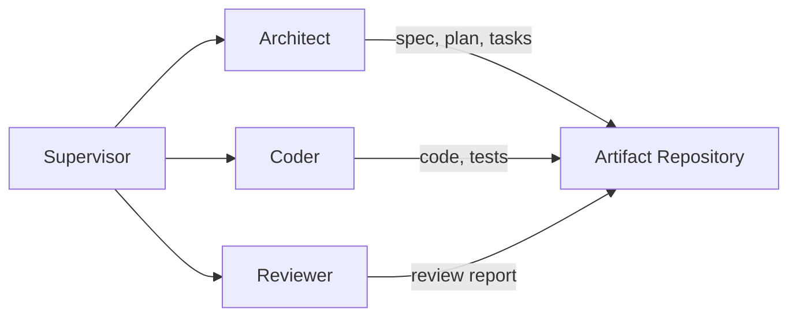
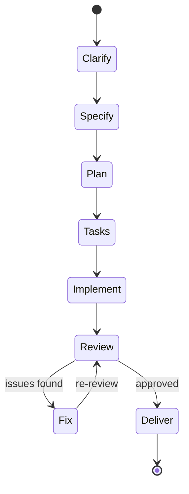

# SpecFlow-Agent v1 Development Plan

版本：v1.0
状态：Draft
最后更新：2026-03-24
依据文档：[system-architecture.md](system-architecture.md)

---

## 0. Plan Overview

v1 目标：输入一段模糊业务需求，系统自动完成需求澄清、规格生成、任务拆解、代码生成、基础测试到质量评审的闭环，交付可运行的基础项目与标准化工件。

Phase 1 聚焦最小闭环：单模板（简化版内部工单系统）、单技术栈、CLI 触发、输出规格 + 代码 + 测试 + 评审报告。

### 技术栈

- **平台自身**: Python, Deep Agents, LangGraph, FastAPI, PostgreSQL, Spec Kit
- **生成目标项目**: FastAPI + React + Vite + TypeScript + PostgreSQL + pytest + Playwright

### 角色模型



### Sprint 总览

| Sprint | 主题 | 周期 |
|--------|------|------|
| Sprint 1 | Project Foundation and Infrastructure | Week 1-2 |
| Sprint 2 | State Management and Artifact Storage | Week 3 |
| Sprint 3 | MCP Capability Layer | Week 4-5 |
| Sprint 4 | Agent Implementation - Architect | Week 6-7 |
| Sprint 5 | Agent Implementation - Coder & Reviewer | Week 8-9 |
| Sprint 6 | Orchestration Layer - Supervisor | Week 10-11 |
| Sprint 7 | CLI Entry Point and End-to-End Integration | Week 12-13 |

---

## Sprint 1: Project Foundation and Infrastructure (Week 1-2)

### 1.1 项目脚手架

- 初始化 Python monorepo 结构，使用 `uv` 管理依赖
- 建立项目目录骨架：

```
specflow-agent/
  src/
    specflow/
      cli/              # CLI 入口
      api/              # FastAPI 入口 (Phase 2)
      orchestrator/     # Supervisor 编排层
      agents/           # Architect / Coder / Reviewer
      mcp/              # MCP 工具层
      models/           # 数据模型
      storage/          # 状态与工件存储
      templates/        # 项目模板库
      config/           # 配置管理
  tests/
  runs/                 # 运行时工作区（gitignore）
  docs/
```

- 配置 `pyproject.toml`，添加核心依赖：`deep-agents`, `langgraph`, `langchain-core`, `fastapi`, `sqlalchemy`, `typer`, `pydantic`
- 配置 linter（ruff）、formatter（black）、type checker（mypy）

### 1.2 配置与环境管理

- 定义 `Settings` Pydantic 模型，管理 LLM provider、数据库连接、工作区根路径等
- 支持 `.env` 文件加载
- 本地开发阶段数据库默认使用 SQLite，正式环境使用 PostgreSQL

### 1.3 核心数据模型

根据架构文档 Section 7，实现最小数据模型：

- `Project`: 项目标识、模板类型、目标技术栈
- `Run`: 一次完整执行实例，包含 `run_id`、状态、阶段指针
- `Artifact`: 文档/规格/计划/评审报告，关联 `run_id`
- `TaskItem`: 任务拆解结果与执行状态
- `ReviewIssue`: Reviewer 输出的问题项
- `ExecutionEvent`: 关键阶段事件、错误、审批记录
- `TemplateProfile`: 模板版本、约束与默认配置

使用 SQLAlchemy ORM + Alembic 迁移管理。

---

## Sprint 2: State Management and Artifact Storage (Week 3)

### 2.1 运行态状态管理

- 实现 `RunStateManager`：
  - 创建/加载 `run_id`
  - 阶段状态机（`clarify -> specify -> plan -> tasks -> implement -> review -> deliver`）
  - 阶段转换验证与回退能力
  - 失败重试计数器
  - 人工闸门标记



### 2.2 工件存储层

- 实现 `ArtifactRepository`：
  - 按 `/runs/{run_id}/artifacts/`、`/runs/{run_id}/workspace/`、`/runs/{run_id}/reports/` 组织
  - 工件 CRUD 接口：`save_artifact()`, `load_artifact()`, `list_artifacts()`
  - 工件版本追踪（支持规格冻结前后区分）
  - 工件元数据写入数据库

### 2.3 Checkpointer 集成

- 对接 Deep Agents 的 `StateBackend + StoreBackend`
- 实现阶段级 checkpoint 保存与恢复
- 确保中断后可从最近阶段恢复

---

## Sprint 3: MCP Capability Layer (Week 4-5)

### 3.1 MCP Server 骨架

- 搭建 MCP Server 基础框架
- 实现工具注册、路由与权限校验机制
- 定义统一的工具调用接口规范

### 3.2 五组核心工具

按架构文档 Section 5.5 实现：

**scaffold_tools**

- `create_project_skeleton`: 基于模板初始化目录结构与基础配置文件
- `init_git_repo`: 初始化 git 仓库与 `.gitignore`

**template_tools**

- `search_templates`: 检索页面模板、API 模板、测试模板
- `get_template_content`: 获取指定模板内容
- `list_available_templates`: 列出可用模板清单

**workspace_tools**

- `read_file`: 沙箱内文件读取
- `write_file`: 沙箱内文件写入
- `list_directory`: 目录列表
- `delete_file`: 文件删除（需权限校验）

**quality_tools**

- `run_lint`: 运行 lint 检查
- `run_tests`: 运行测试套件
- `run_build`: 执行构建
- `check_types`: 类型检查

**spec_tools**

- `read_spec`: 读取规格工件
- `export_spec_summary`: 导出规格摘要
- `validate_spec_completeness`: 校验规格缺失项

### 3.3 工作区沙箱

- 实现受控工作区，所有文件操作限定在 `/runs/{run_id}/workspace/` 内
- 路径校验防止目录穿越
- 最终交付物与中间产物分离

---

## Sprint 4: Agent Implementation - Architect (Week 6-7)

### 4.1 Architect Agent 核心

- 实现 Architect Agent，职责覆盖：
  - 需求澄清（`clarify`）：对模糊需求进行结构化补全
  - 规格生成（`specify`）：输出 `spec.md`、`data-model.md`
  - 方案规划（`plan`）：输出 `plan.md`、`research.md`
  - 契约定义：输出 `contracts/` 目录下 API 契约
  - 任务拆解草案：输出 `tasks.md` 初稿

### 4.2 Spec Kit 集成

- 集成 Spec Kit 工件目录结构
- 实现 constitution 初始化（`.specify/memory/constitution.md`）
- 确保 Architect 输出严格遵循 Spec Kit 阶段模型

### 4.3 需求澄清子图（LangGraph）

- 使用 LangGraph 实现多轮澄清循环：
  - 输入：原始模糊需求
  - 过程：识别缺失信息 -> 生成澄清问题 -> 获取补充 -> 判断是否充分
  - 输出：结构化需求文档
  - 最大轮次限制（防止死循环）

### 4.4 默认模板："简化版内部工单系统"

- 编写工单系统模板 profile：
  - 标准实体：工单、用户、部门、评论、附件
  - 标准页面：列表、详情、创建、编辑、仪表盘
  - 标准 API：CRUD + 状态流转 + 分页查询
  - 标准约束：角色权限、工单状态机

---

## Sprint 5: Agent Implementation - Coder & Reviewer (Week 8-9)

### 5.1 Coder Agent

- 基于冻结规格与任务清单执行实现：
  - 按 `tasks.md` 逐项生成代码
  - 调用 `scaffold_tools` 初始化项目骨架
  - 调用 `template_tools` 获取代码模板
  - 调用 `workspace_tools` 写入生成代码
  - 生成 `README.md`
  - 调用 `quality_tools` 运行测试与构建验证
- 生成目标项目结构：

```
workspace/
  backend/
    app/
      models/
      routers/
      schemas/
      services/
    tests/
    alembic/
    main.py
    requirements.txt
  frontend/
    src/
      components/
      pages/
      services/
      types/
    package.json
    vite.config.ts
```

### 5.2 Reviewer Agent

- 对照冻结规格进行一致性审查：
  - 读取 `spec.md` 与生成代码
  - 逐项比对功能点覆盖度
  - 检查 API 契约一致性
  - 检查数据模型完整性
  - 检查测试覆盖情况
  - 输出 `review-report.md`，包含：问题列表、严重等级、修复建议、阻断结论

### 5.3 Review-Fix 循环（LangGraph）

- 使用 LangGraph 实现 Reviewer-Coder 差异校验与修复循环：
  - Reviewer 输出问题列表
  - Supervisor 判断是否需要修复
  - Coder 按问题修复
  - Reviewer 再审
  - 最大迭代次数限制 + 人工仲裁兜底

---

## Sprint 6: Orchestration Layer - Supervisor (Week 10-11)

### 6.1 Supervisor Orchestrator

- 基于 Deep Agents 实现顶层编排：
  - 创建并管理 `run_id`
  - 初始化项目上下文（模板、技术栈、约束）
  - 维护阶段状态机，驱动 Agent 按序执行
  - 管理子 Agent 委派与结果收集
  - 失败重试与回退策略
  - 汇总工件并输出最终交付

### 6.2 人工闸门集成

- 实现 `HumanGate` 机制：
  - 规格冻结确认
  - 覆盖关键文件确认
  - 进入最终交付确认
  - Reviewer 发现高严重度偏差时暂停
- CLI 模式下通过终端交互实现
- 支持"调试模式"跳过闸门（仅限开发阶段）

### 6.3 可观测性

- 实现 `ExecutionLogger`：
  - 每阶段开始/结束时间记录
  - Agent 输入/输出摘要
  - MCP 工具调用日志
  - 测试与构建结果记录
  - 失败原因与重试次数
  - 全部写入 `execution_event` 表

---

## Sprint 7: CLI Entry Point and End-to-End Integration (Week 12-13)

### 7.1 CLI 实现

- 使用 `typer` 实现 CLI 入口：
  - `specflow run "需求描述"`: 启动完整流程
  - `specflow run --template ticket-system --mode debug`: 指定模板与模式
  - `specflow status <run_id>`: 查看运行状态
  - `specflow artifacts <run_id>`: 列出生成工件
  - `specflow resume <run_id>`: 从中断点恢复

### 7.2 End-to-End Integration

- 将所有组件串联：
  - CLI -> Supervisor -> Architect -> (Human Gate) -> Coder -> Reviewer -> (Fix Loop) -> Deliver
- 端到端冒烟测试：
  - 输入："帮我做一个内部工单管理系统"
  - 验证输出：spec.md, plan.md, tasks.md, 项目代码, 测试结果, review-report.md

### 7.3 测试策略

- 单元测试：各 Agent 独立测试（mock LLM 响应）
- 集成测试：MCP 工具层 + 工件存储层
- 端到端测试：完整流程跑通（可使用低成本模型）
- 使用 pytest + pytest-asyncio

### 7.4 文档与交付

- 编写 `README.md`：项目介绍、快速开始、配置说明
- 编写 `CONTRIBUTING.md`：开发规范、提交流程
- 补充 `docs/` 下的技术文档

---

## Phase 2 / Phase 3 Roadmap (Post v1)

以下为 v1 之后的演进方向，不在当前开发范围内，但需在架构设计中预留扩展点：

**Phase 2 - 平台能力增强**

- FastAPI Web UI + 运行历史可视化
- 人工审批界面（替代 CLI 交互）
- 模板管理后台
- 多用户与权限管理

**Phase 3 - 组织级复用**

- 多模板支持（审批系统、台账系统、CRUD 管理后台）
- 组织规范记忆（长期记忆层）
- MCP 工具生态扩展
- Brownfield 改造能力

---

## Risk Mitigation Checklist

| Risk | Mitigation |
|------|------------|
| 需求模糊导致偏题 | Sprint 4 强制 clarify 阶段 + 冻结验收标准 |
| 代码与规格脱节 | Sprint 5 Reviewer 按冻结 spec 逐项比对 |
| 长链路上下文漂移 | 以工件为中心的 Agent 协作，非对话记忆 |
| 工具能力过宽 | Sprint 3 仅实现 5 组高价值工具 |
| 工作区污染 | Sprint 2 独立工作区 + run_id 隔离 |
| 评审无法收敛 | Sprint 5 最大迭代次数 + 人工仲裁 |
