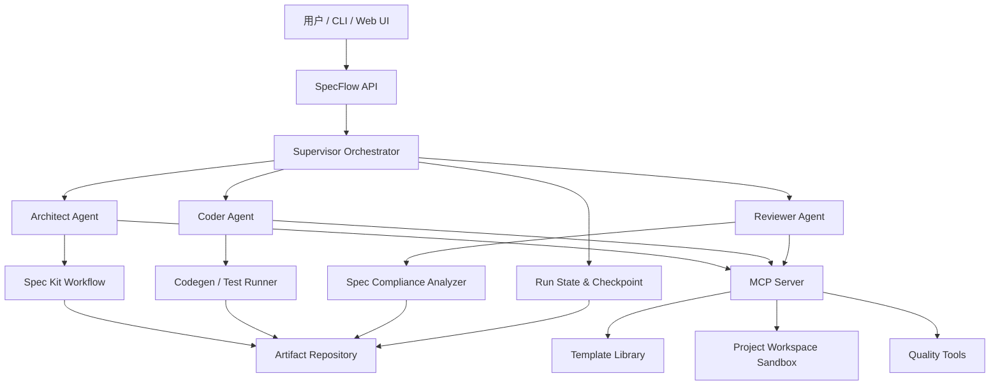
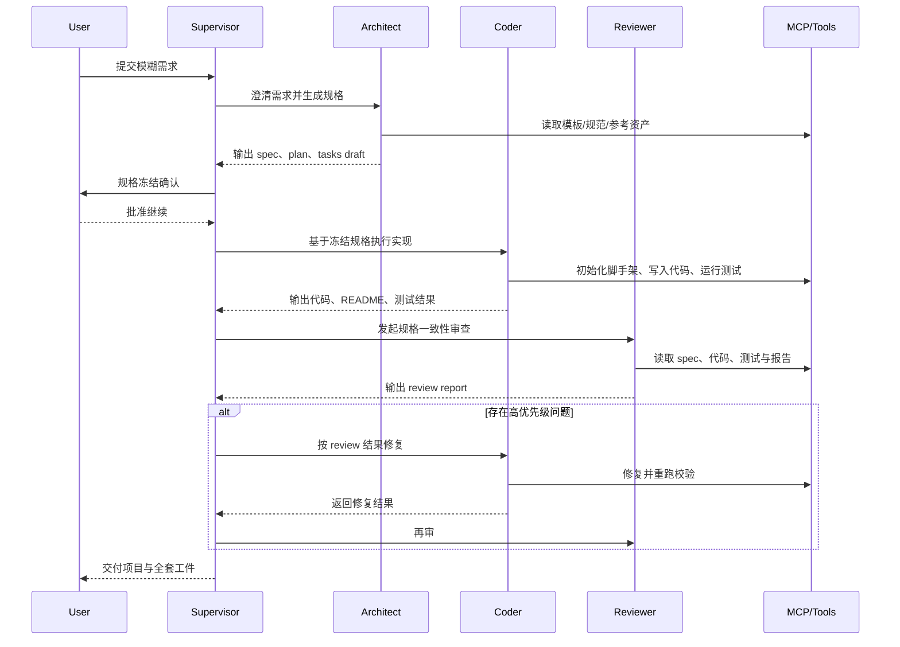

# SpecFlow-Agent 系统架构设计文档

版本：v1.0.0  
状态：Implemented for v1  
项目名称：SpecFlow-Agent  
最后更新：2026-03-24

## 1. 文档目的

本文档用于定义 `SpecFlow-Agent` 的 v1 系统架构，明确产品边界、核心组件、Agent 协作模式、状态管理方式、MCP 能力边界与非功能性要求，作为后续产品立项、系统实现与技术评审的统一依据。

## 2. 项目定义

### 2.1 项目愿景

将内部研发过程从依赖个人经验的手工协作，升级为可复用、可审计、可追踪的标准化 AI 研发流水线。

### 2.2 v1 目标

输入一段模糊的业务需求，系统自动完成从需求澄清、规格生成、任务拆解、代码生成、基础测试到质量评审的闭环，并交付一套可运行的基础项目与标准化工件。

### 2.3 v1 目标场景

从设计目标上，`v1` 面向一类高复用、高标准化的内部系统场景：

- 内部工单系统
- 内部台账/配置系统
- 简单审批前置系统
- 标准 CRUD 管理后台

但当前仓库的实际落地版本仅实现了“简化版内部工单系统”这一默认模板，其他模板类型仍属于后续演进范围。

### 2.4 v1 非目标

为保证工程可落地性，`v1` 明确不覆盖以下范围：

- 任意技术栈自动选择
- 复杂工作流引擎
- 多租户 SaaS 架构
- 自动生产部署
- 大规模第三方系统集成
- 零人工干预的完全自治式研发
- 面向所有业务类型的通用软件生成

## 3. 架构设计原则

### 3.1 规格优先

系统以 `Spec Kit` 作为 `v1` 的唯一规格真源，所有 Agent 的执行、评审与回溯均以规格工件为准，而不是以对话上下文为准。

### 3.2 工件驱动

长链路执行必须沉淀为可检索工件，包括但不限于：

- `constitution`
- `spec`
- `clarification notes`
- `plan`
- `tasks`
- `review report`
- `test report`
- `run log`

### 3.3 分阶段收敛

系统不采用“一次 prompt 生成全部结果”的模式，而是采用阶段式收敛：

1. 需求澄清
2. 规格生成
3. 方案规划
4. 任务拆解
5. 代码实现
6. 质量评审
7. 修正与交付

### 3.4 人工闸门

`v1` 采用 `human-gated automation`。在高风险节点触发人工确认，例如：

- 规格冻结
- 覆盖关键文件
- 进入最终交付
- Reviewer 发现高严重度偏差

### 3.5 可追踪与可复盘

每次运行都应具备唯一 `run_id`，并保存阶段状态、输入输出工件、Agent 决策摘要、工具调用记录和失败原因。

## 4. 总体架构

`SpecFlow-Agent` 采用“编排层 + 多 Agent 执行层 + MCP 能力层 + 工件存储层”的分层架构。

## 5. 核心组件设计

### 5.1 交互入口层

负责接收用户输入与返回执行结果，提供两类入口：

- `CLI`：适合研发人员本地触发与调试
- `Web UI / API`：适合平台化运行、流程可视化与后续权限治理

输入内容包括：

- 原始需求描述
- 可选约束条件
- 目标模板类型
- 技术栈配置
- 执行模式（标准人工闸门 / 调试模式）

输出内容包括：

- 运行状态
- 当前阶段
- 生成工件
- 评审结果
- 最终项目交付地址

### 5.2 编排层

编排层是系统主脑，由 `Supervisor Orchestrator` 负责管理一次完整运行。

#### 职责

- 创建与管理 `run_id`
- 初始化项目上下文
- 维护阶段状态机
- 调度不同角色 Agent
- 管理失败重试与回退
- 控制人工确认节点
- 汇总工件并输出最终交付

#### 技术选择

顶层编排采用 `Deep Agents`，原因如下：

- 支持多步任务规划
- 支持子 Agent 委派
- 支持状态与记忆
- 适合长链路工件化协作

在需要精细控制循环或条件跳转的子流程中，可局部使用 `LangGraph` 子图，例如：

- Reviewer 的差异校验与重试循环
- 需求澄清阶段的多轮补全

### 5.3 角色 Agent 层

系统采用 4 角色设计，而非仅 3 个研发角色。

| 角色 | 核心职责 | 输入 | 输出 |
|---|---|---|---|
| Supervisor | 管理阶段推进、状态同步、人工闸门、失败恢复 | 用户需求、运行配置 | 阶段结果、最终交付 |
| Architect | 负责需求澄清、规格生成、方案规划 | 原始需求、模板约束 | `spec`、`plan`、`contracts`、`tasks draft` |
| Coder | 基于规格生成项目代码、测试与 README | 已冻结规格与任务清单 | 前后端代码、测试、文档 |
| Reviewer | 对照规格核查实现完整性与偏差 | `spec`、代码、测试结果 | review report、修复建议、阻断结论 |

#### 角色协作原则

- Agent 之间通过工件协作，不通过隐式对话记忆协作
- 所有 Agent 读取同一份规格真源
- 子 Agent 任务需一次性交付完整指令，避免依赖跨调用记忆
- Reviewer 不直接修改规格，只输出偏差和修复建议

### 5.4 规格与流程层

`Spec Kit` 作为 `v1` 的主流程骨架，承担研发过程标准化职责。

#### 采用方式

系统将围绕以下阶段组织执行：

1. `constitution`
2. `specify`
3. `clarify`
4. `plan`
5. `tasks`
6. `implement`

#### 设计约束

- `v1` 不混用 `OpenSpec` 作为第二规格真源
- 所有执行必须围绕 `Spec Kit` 工件目录展开
- Reviewer 仅对冻结版本的规格进行比对

#### 典型工件

- `.specify/memory/constitution.md`
- `spec.md`
- `plan.md`
- `research.md`
- `data-model.md`
- `contracts/`
- `tasks.md`
- `review-report.md`

### 5.5 MCP 能力层

MCP 层用于为 Agent 提供稳定、受控的外部能力，不承载主业务流程编排。

#### v1 MCP 目标

仅提供少量高价值能力：

- 项目脚手架生成
- 模板与组件检索
- 项目工作区读写
- 测试运行
- 质量检查执行
- 仓库规范读取

#### 不承担的职责

- 不承担规格流程定义
- 不承担运行状态持久化
- 不承担跨阶段主流程编排

#### 推荐工具分组

| 工具组 | 说明 |
|---|---|
| `scaffold_tools` | 初始化项目骨架、目录结构、基础配置 |
| `template_tools` | 检索页面模板、API 模板、测试模板 |
| `workspace_tools` | 在沙箱内读写项目文件 |
| `quality_tools` | 运行 lint、test、build、e2e |
| `spec_tools` | 读取规格工件、导出摘要、校验缺失项 |

### 5.6 状态与工件存储层

系统必须显式区分“运行态状态”和“长期沉淀资产”。

#### 运行态状态

用于保存一次执行过程中的阶段信息：

- 当前阶段
- Agent 结果摘要
- 审批状态
- 失败重试次数
- 当前任务指针

建议使用：

- `checkpointer` 保存运行过程状态
- `run_state` 表保存阶段级元数据

#### 长期沉淀资产

用于跨运行复用与审计：

- 项目工件
- 模板版本
- 评审报告
- 历史运行记录
- 组织规范与偏好

建议使用：

- `PostgreSQL` 保存元数据
- 对象存储或文件仓库存放文档与生成物

#### Agent 记忆设计

结合 Deep Agents 的约束，采用分层记忆：

- 短期状态：当前 `run` 的阶段上下文与 todo
- 长期记忆：组织级规范、模板偏好、历史问题模式

注意事项：

- 在服务端模式下，不直接依赖 `FilesystemBackend` 对真实磁盘进行开放式操作
- 正式运行建议采用 `StateBackend + StoreBackend` 或等价的受控路由方式
- 本地开发与 CLI 调试模式可在虚拟目录下启用受限文件系统访问

### 5.7 生成项目工作区

工作区用于承载生成中的目标项目，不应与平台自身代码库强耦合。

#### 设计要求

- 每次运行独立创建工作区
- 工作区路径与 `run_id` 绑定
- 所有写操作必须在沙箱或受控目录中进行
- 最终交付物与中间产物分离存储

#### 目录建议

- `/runs/{run_id}/artifacts/`：规格、计划、评审报告
- `/runs/{run_id}/workspace/`：生成中的项目代码
- `/runs/{run_id}/reports/`：测试、构建、评审结果

## 6. 核心执行流程

## 7. 数据模型建议

`v1` 推荐最小数据模型如下：

| 实体 | 说明 |
|---|---|
| `project` | 项目标识、模板类型、目标技术栈 |
| `run` | 一次完整执行实例 |
| `artifact` | 文档、规格、计划、评审与测试报告 |
| `task_item` | 任务拆解结果与执行状态 |
| `review_issue` | Reviewer 输出的问题项 |
| `execution_event` | 关键阶段事件、错误、审批记录 |
| `template_profile` | 模板版本、约束与默认配置 |

关键关系：

- 一个 `project` 可关联多次 `run`
- 一个 `run` 产生多份 `artifact`
- 一个 `run` 包含多条 `task_item`
- 一个 `run` 可产生多条 `review_issue`

## 8. v1 默认技术栈

### 8.1 平台自身

- `Python`
- `Deep Agents`
- `LangGraph`
- `FastAPI`
- `PostgreSQL`
- `Spec Kit`

### 8.2 生成目标项目

- `FastAPI`
- `React`
- `Vite`
- `TypeScript`
- `PostgreSQL`
- `pytest`
- `Playwright`

本地开发阶段可允许数据库临时降级为 `SQLite`，以降低启动成本；正式模板仍以 `PostgreSQL` 为默认目标。

选择原因：

- 技术边界清晰
- 前后端分层明显
- 易于按规格生成 API、页面与测试
- 演示效果与工程价值兼顾

## 9. 非功能性设计

### 9.1 可维护性

- 规格、模板、执行器三者解耦
- Agent 职责单一化，避免单 Agent 全包
- 工具调用通过 MCP 抽象，减少业务与工具耦合

### 9.2 可观测性

必须记录以下信息：

- 每阶段开始与结束时间
- Agent 输入摘要与输出摘要
- 工具调用记录
- 测试与构建结果
- 失败原因与重试次数

### 9.3 可恢复性

- 阶段失败后可从最近工件恢复
- 每个阶段应具备幂等执行能力
- 评审失败不强制回滚至最初需求阶段

### 9.4 安全性

- 工具调用最小权限化
- 工作区隔离
- 文件写入范围可控
- 敏感操作必须人工确认

## 10. 关键风险与应对

| 风险 | 描述 | 应对策略 |
|---|---|---|
| 需求模糊导致偏题 | Architect 误解业务意图 | 强制 `clarify` 阶段并冻结验收标准 |
| 代码与规格脱节 | Coder 可能局部发挥过多 | Reviewer 按冻结 spec 逐项比对 |
| 长链路上下文漂移 | 多轮调用后目标偏移 | 以工件为中心而非对话为中心 |
| 工具能力过宽 | MCP 工具容易演变为万能执行器 | 仅开放窄而硬的高价值工具 |
| 工作区污染 | 多次运行互相覆盖 | 每次运行独立工作区与 `run_id` |
| 评审无法收敛 | Reviewer 和 Coder 循环拉扯 | 设置最大迭代次数与人工仲裁 |

## 11. 分阶段落地建议

### Phase 1

完成最小闭环：

- 单模板输入
- 单固定技术栈
- 本地 CLI 触发
- 输出规格、代码、测试、评审报告

### Phase 2

增强平台能力：

- Web UI
- 运行历史
- 人工审批界面
- 模板管理

### Phase 3

增强组织级复用：

- 多模板支持
- 组织规范记忆
- 更丰富的 MCP 工具生态
- Brownfield 改造能力

## 12. 结论

`SpecFlow-Agent v1` 的核心不是“生成代码”，而是建立一条围绕 `Spec Kit` 真源运转的、可追踪、可复盘、可迭代的标准化研发流水线。

该架构的关键判断如下：

- 使用 `Spec Kit` 作为唯一规格真源
- 使用 `Deep Agents` 作为顶层编排
- 在局部复杂环节引入 `LangGraph`
- 使用 MCP 作为受控能力层而非流程层
- 采用 4 角色协作模型：`Supervisor / Architect / Coder / Reviewer`
- `v1` 聚焦“简化版内部工单系统”这一高价值模板场景

在该边界下，项目具备较高可实现性，同时具备明显的产品化与工程化含金量。
